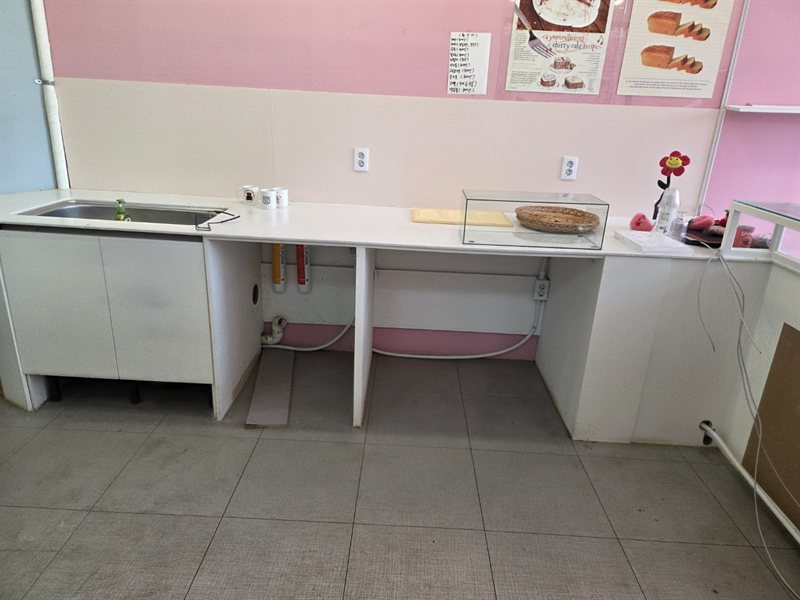

# 바로철거 — 이미지 삽입 작업 매뉴얼 (이미지 담당 AI 필독)

> **이 파일은 이미지를 생성·삽입하는 AI가 작업 전 가장 먼저 읽어야 하는 문서입니다.**
> 이 사이트는 레이아웃·모션·스냅 스크롤이 이미 완성된 상태입니다.
> 당신의 임무는 **정해진 자리(`.ph` 플레이스홀더)에 이미지를 채우는 것뿐**이며,
> 그 외의 HTML 구조·CSS 레이아웃·JS 로직은 **절대 수정하지 않습니다.**

---

## 0. 작업 전 반드시 확인할 것 (코드 파악 절차)

작업을 시작하기 전에 아래 파일을 이 순서로 열어 구조를 확인하세요.

1. `assets/css/common.css` — 8~22행의 `:root` 색상 변수와 306행 부근의 `.ph` 플레이스홀더 정의
2. `assets/css/pages.css` — 573행 이후의 **풀페이지 스냅 모드** 블록 (`body[data-snap]`).
   데스크톱에서 메인 섹션이 전부 `100vh`로 고정되므로, 이미지가 이 높이 계산을 깨면 안 됩니다.
3. `index.html` — `.ph`가 있는 곳이 곧 이미지 자리입니다 (아래 3장 인벤토리와 대조)
4. `gallery.html` — 갤러리 9칸 + 라이트박스 1칸
5. `assets/js/common.js` — 스냅 스크롤·리빌·라이트박스 로직. **읽기만 하고 수정 금지** (예외: 5-3의 라이트박스 3줄)

### 이 사이트의 제작 방식 요약
- **빌드 도구 없음.** 순수 HTML/CSS/JS. 카페24에 FTP로 그대로 올라갑니다. npm·프레임워크·외부 라이브러리 추가 금지.
- 모든 경로는 **상대경로** (`./assets/img/...`).
- 이미지 자리는 전부 `<div class="ph">설명 · 규격</div>` 형태의 회색 박스로 만들어져 있습니다.
- 메인(`index.html`)은 `<body data-snap>` 상태로, 데스크톱(1024px+ · 마우스 · 모션 허용)에서
  휠 한 번에 섹션 단위로 넘어가는 풀페이지 스냅이 동작합니다.
- 스크롤 리빌은 `.reveal` 클래스가 담당합니다. 이미지에 `.reveal`을 새로 붙이지 마세요 (부모가 이미 갖고 있음).

---

## 1. 절대 규칙

1. **`.ph` 교체 외의 코드 변경 금지.** 클래스명 변경·삭제, 섹션 구조 변경, JS 수정(5-3 예외) 모두 금지.
2. 이미지 파일은 전부 `assets/img/`에 저장. 외부 URL(스톡 사이트 등) 하드코딩 금지.
3. 모든 ``에 **`alt`, `width`, `height`를 명시** (레이아웃 시프트 방지). 히어로 배경만 장식이므로 `alt=""`.
4. 히어로를 제외한 모든 이미지에 `loading="lazy"`.
5. 파일 용량: 일반 800×600 → **400KB 이하**, 히어로 2000×1200 → **600KB 이하**. 포맷은 JPG(품질 80) 권장.
6. 이미지 안에 텍스트·로고·워터마크·전화번호를 넣지 마세요.
7. CSS 추가는 **이 문서 5장에 적힌 블록을 `pages.css` 맨 끝에 그대로 붙이는 것만** 허용됩니다.

---

## 2. 이미지 무드 가이드 (생성 시 프롬프트 기준)

사이트 톤: **고급스럽고 절제된 신뢰감.** 원색·과장·합성 티가 나는 이미지는 전부 반려 대상입니다.

- **색감**: 저채도 · 차분한 톤. 사이트 팔레트와 어울릴 것 —
  블랙 `#0E0E10` / 차콜 `#1C1C1E` / 오프화이트 `#F7F6F3` / 웜 그레이 `#F1EFEA` / 오렌지(포인트) `#C2410C`
  > **팔레트 변경 이력**: 웜 그레이+앰버 → (2026-08-27) 네이비+화이트 → (2026-08-31) **블랙+웜 그레이+오렌지**.
  > 네이비는 중간 명도라 흰 글씨·검은 글씨 어느 쪽과도 대비가 애매해 클라이언트가 가독성을 지적했다.
  > 현재 팔레트는 웜 톤이므로 **네이비 시기에 맞춰 색보정한 이미지가 있다면 같이 손볼지** 먼저 판단할 것.
- **분위기**: 실제 한국 철거·공사 현장의 담담한 기록 사진 느낌. 새벽/흐린 날의 자연광, 약간 어두운 노출.
  푸른 기가 강한(쿨 화이트 형광등·블루아워) 사진은 현재 웜 팔레트와 부딪힌다 —
  중성~살짝 따뜻한 기 도는 광선을 고른다. 다만 석양처럼 노란빛이 과한 것도 금지.
- **소재**: 내부 철거 현장, 방진막, 폐기물 마대, 트럭·집게차, 정리된 자재, 장갑 낀 손, 안전모.
  인물이 나오면 얼굴이 식별되지 않게 (뒷모습·원거리).
- **금지**: 3D 렌더 티, 과포화 원색, 미국식 공사장, 식별 가능한 타사 로고·번호판·간판, 과한 HDR.
- **일관성**: 전체 이미지를 같은 색보정 톤으로 통일하세요. 한 장만 튀면 전체가 싸 보입니다.

---

## 3. 이미지 슬롯 인벤토리 (전체 16곳)

| # | 파일 : 위치 | 슬롯 | 저장 파일명 | 규격(px) | 내용 |
|---|---|---|---|---|---|
| ~~1~~ | `index.html` (`.hero-bg`) | ~~히어로 배경~~ | — | — | **이미지 슬롯 아님.** 배경 영상(`assets/video/hero.mp4`)으로 대체됨 → [4-0](#4-0-히어로-배경-영상) |
| 2 | `index.html:235` | 시공사례 1 | `case-01.jpg` | 800×600 | 상가 원상복구 |
| 3 | `index.html:236` | 시공사례 2 | `case-02.jpg` | 800×600 | 사무실 인테리어 철거 (야간) |
| 4 | `index.html:237` | 시공사례 3 | `case-03.jpg` | 800×600 | 학교 시설 철거 |
| 5 | `index.html:238` | 시공사례 4 | `case-04.jpg` | 800×600 | 전시 부스 철거 |
| 6 | `index.html:239` | 시공사례 5 | `case-05.jpg` | 800×600 | 아파트 리모델링 철거 |
| 7 | `index.html:240` | 시공사례 6 | `case-06.jpg` | 800×600 | 대량 폐기물 · 5톤 집게차 |
| 8~16 | `gallery.html:52~60` | 갤러리 9칸 | `gallery-01.jpg` ~ `gallery-09.jpg` | 800×600 | 각 행의 `data-caption` 내용과 일치시킬 것 |

- 갤러리 1~6번은 메인 case-01~06과 **같은 이미지를 재사용**합니다 (`gallery-01.jpg` = `case-01.jpg` 복사본이 아니라 동일 파일을 참조해도 됨 — 참조 재사용 권장).
- `gallery.html:71`의 라이트박스 `.ph`는 별도 이미지가 아니라 5-3 방식으로 클릭된 이미지를 그대로 띄웁니다.
- OG 이미지: `assets/img/og.png` 1200×630 — 히어로 배경을 크롭해 로고(`assets/img/logo-h-white.png`)를 얹어 제작.

---

## 4. 반응형 브레이크포인트 — 이미지가 겪는 변화

| 구간 | 조건 | 이미지에 일어나는 일 |
|---|---|---|
| 데스크톱 스냅 | `min-width:1024px` + `pointer:fine` + 모션 허용 | 메인 섹션이 `100vh` 고정. **시공사례 카드는 `aspect-ratio`가 풀리고 높이 `24vh`로 강제** → `object-fit:cover` 필수 |
| 태블릿 | `max-width:960px` | 시공사례·갤러리 3열 → 2열 |
| 모바일 | `max-width:620px` | 시공사례 1열, 갤러리 1열. 히어로 배경은 세로 크롭됨 → 중요한 피사체를 중앙에 |
| 최소 보장 | 360px | 이 폭에서 깨지면 실패. 검증 필수 |

핵심: **크롭에 안전한 이미지**를 만드세요. 주요 피사체를 중앙 60% 안에 두면 모든 구간에서 안전합니다.

---

## 5. 삽입 방법 — 그대로 따라 할 것

### 4-0. 히어로 배경 영상

히어로는 **이미지가 아니라 영상**입니다. `.hero-bg` 안에 ``를 넣지 마세요.

```html
<video class="hero-video" muted loop playsinline preload="none"
       poster="./assets/video/hero-poster.jpg" width="1920" height="1012">
  <source src="./assets/video/hero.webm" type="video/webm">
  <source src="./assets/video/hero.mp4" type="video/mp4">
</video>
```

영상을 교체할 때 —

1. 원본을 `assets/video/`에 두고 (`.mov`는 `.gitignore` 처리되어 커밋되지 않음) 아래로 변환한다.
   ```
   ffmpeg -i 원본 -an -vf "scale=1920:-2" -c:v libx264 -crf 25 -preset slow -pix_fmt yuv420p -movflags +faststart assets/video/hero.mp4
   ffmpeg -i 원본 -an -vf "scale=1600:-2" -c:v libvpx-vp9 -crf 36 -b:v 0 -row-mt 1 assets/video/hero.webm
   ffmpeg -ss 1 -i 원본 -frames:v 1 -vf "scale=1920:-2" -q:v 5 assets/video/hero-poster.jpg
   ```
2. **소리 트랙은 반드시 제거**(`-an`)한다. 자동재생은 무음일 때만 허용된다.
3. mp4는 5MB 이하를 넘기지 않는다. 넘으면 `-crf` 값을 올린다.
4. 교체 후 `.hero-video`의 `opacity`(현재 0.34)를 다시 맞춘다 — **히어로 문구 대비 7:1 이상**이 기준.
   영상이 밝을수록 값을 낮춘다. 재생 중 가장 밝은 프레임 기준으로 확인할 것.
5. `preload="none"` 과 `muted` 속성은 지우지 않는다. 재생 시작은 `common.js`가 조건(데스크톱 · 데이터 절약 꺼짐 · 모션 최소화 아님)을 확인한 뒤 처리한다.

### 5-2. 시공사례 카드 (`index.html:235~240`) — 6곳 동일 패턴

```html
<!-- 교체 전 -->
<figure class="case-card reveal"><div class="ph">시공 사진 · 800×600</div><figcaption>상가 원상복구<span>서울 · 철거 + 폐기물 처리</span></figcaption></figure>
<!-- 교체 후 (figure·figcaption·reveal·--reveal-delay는 그대로 유지) -->
<figure class="case-card reveal"><figcaption>상가 원상복구<span>서울 · 철거 + 폐기물 처리</span></figcaption></figure>
```

`alt`는 각 카드의 figcaption 내용을 자연문으로 풀어 쓰세요 (예: "학교 시설 철거 현장 — 방학 기간 시공").

### 5-3. 갤러리 + 라이트박스 (`gallery.html`)

각 `.gallery-item`의 `.ph`를 교체하고, 버튼에 `data-img` 속성을 추가합니다.

```html
<!-- 교체 전 -->
<button class="gallery-item" type="button" data-caption="상가 원상복구 — 서울 · 철거 + 폐기물 처리"><figure><div class="ph">시공 사진 · 800×600</div><figcaption>상가 원상복구<span>서울 · 철거 + 폐기물 처리</span></figcaption></figure></button>
<!-- 교체 후 -->
<button class="gallery-item" type="button" data-caption="상가 원상복구 — 서울 · 철거 + 폐기물 처리" data-img="./assets/img/case-01.jpg"><figure><figcaption>상가 원상복구<span>서울 · 철거 + 폐기물 처리</span></figcaption></figure></button>
```

라이트박스 본체(`gallery.html:71`)의 `.ph`는 아래로 교체:

```html

```

`assets/js/common.js`의 `updateLightbox()` 함수(116행 부근, 주석 "실제 사진 적용 시"가 표시된 곳)에 **아래 3줄만** 추가:

```js
var lbImg = lightbox.querySelector('.lb-img');
var src = galleryItems[current].getAttribute('data-img');
if (lbImg && src) { lbImg.src = src; lbImg.alt = galleryItems[current].getAttribute('data-caption') || ''; }
```

### 5-4. CSS — 아래 블록을 `assets/css/pages.css` **맨 끝에 그대로** 추가 (수정 금지)

```css
/* ============================================================
   실사 이미지 적용 (IMAGE_GUIDE.md 기준 — 이미지 AI가 추가)
   ============================================================ */
.hero-video,
.hero-bg img {
  width: 100%;
  height: 100%;
  object-fit: cover;
  opacity: 0.34; /* 텍스트 가독 확보 — 영상/사진이 밝을수록 낮출 것 */
  filter: saturate(0.4) contrast(1.06);
}
.case-img {
  display: block;
  width: 100%;
  aspect-ratio: 4 / 3;
  object-fit: cover;
}
@media (min-width: 1024px) and (pointer: fine) and (prefers-reduced-motion: no-preference) {
  body[data-snap] .case-img { aspect-ratio: auto; height: 24vh; }
}
.lightbox-body .lb-img {
  display: block;
  width: 100%;
  height: auto;
  max-height: 78vh;
  object-fit: contain;
  background: rgba(247, 247, 245, 0.04);
}
```

---

## 6. 작업 후 검증 체크리스트

브라우저에서 `index.html`을 열고 (로컬 서버 권장) 아래를 순서대로 확인하세요.

- [ ] 1440px: 히어로 텍스트가 배경 위에서 또렷한가 (안 또렷하면 opacity를 0.35로)
- [ ] 1440px: 스냅 스크롤로 시공사례 섹션 도달 시 카드 6장이 `100vh` 안에 다 들어오는가
- [ ] 768px / 360px: 가로 스크롤이 생기지 않는가, 카드 크롭이 어색하지 않은가
- [ ] 갤러리: 클릭 시 라이트박스에 해당 이미지가 뜨고 ←/→ 이동 시 이미지가 바뀌는가
- [ ] 개발자도구 Network: 모든 이미지 200 응답 · 용량 기준 준수 · 히어로 외 전부 lazy
- [ ] 콘솔 에러 0건

**16개 슬롯을 전부 채우기 전이라도, 완성된 것부터 순서대로 교체해도 됩니다 — 남은 `.ph`는 그대로 두면 됩니다.**
